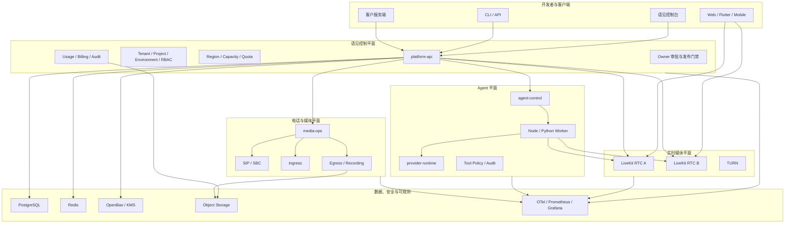
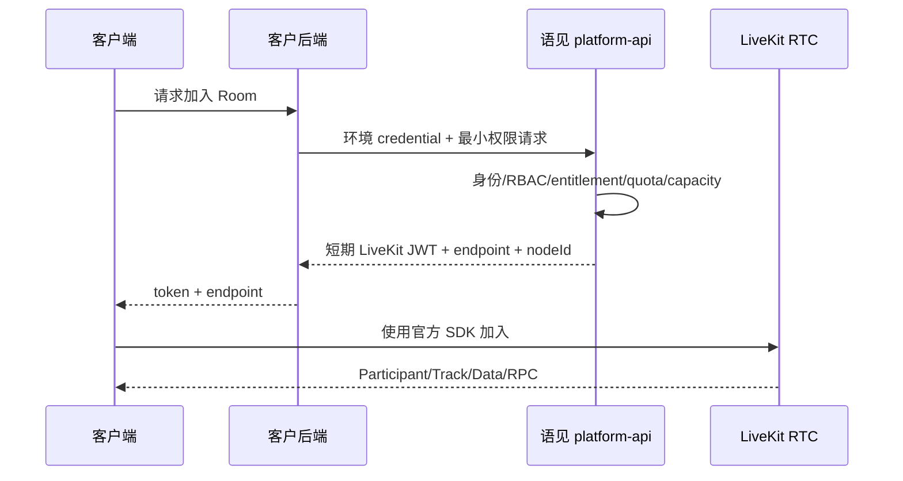
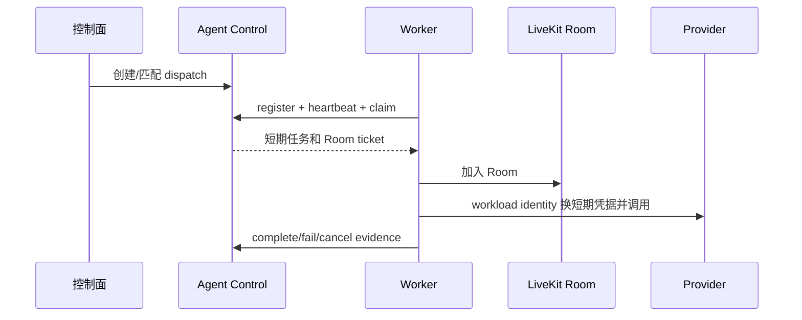

# 语见AI项目详细介绍

版本：v1.0

日期：2026-07-19

文档定位：产品、业务、架构、研发与交付的统一项目说明

当前状态：M3–M7 计划内开发为 `implemented-not-run`；M1 A–C 历史运行基线和
M2/P2-01–06 指定技术验收通过；完整生产 Gate 未通过

## 1. 项目概述

语见AI是面向中国开发者和企业的实时音视频与 AI Agent 基础设施平台。项目目标可以概括为
“建设中国本土化、LiveKit 兼容的实时互动平台”，正式品牌为“语见AI”，英文工程名为
`Yujian Realtime`。

平台不是一款翻译 App，也不以翻译业务为核心。它提供的是开发者可以集成、企业可以部署和
运营的基础能力，包括：

1. 实时音视频房间、参与者、音视频 Track、Data 与 RPC。
2. AI Agent 的制品、部署、调度、运行、工具调用和模型 Provider 接入。
3. SIP 电话、Ingress、Egress、录制、转推流和媒体处理。
4. 多租户、项目、环境、凭据、配额、用量、账单、审计和数据权利控制面。
5. 中国网络与数据驻留约束下的托管云、专有云和私有化交付。
6. 供应链、Owner 审批、发布冻结、RC/GA 决策和可追溯验收证据。

本项目保留 LiveKit 的 Room、Participant、Track、Token grant、Server API 和主流 SDK 语义，
在外围增加语见控制面、运营能力与中国本土化适配。语见扩展使用 `yujian.*` 命名空间，避免
污染上游协议。

## 2. 产品定位

### 2.1 目标用户

| 用户 | 主要需求 | 语见AI提供的价值 |
| --- | --- | --- |
| 实时应用开发者 | 快速接入音视频、Data、RPC | LiveKit 兼容 API、SDK、示例与中文控制面 |
| AI Agent 开发者 | 将语音/多模态 Agent 接入 Room | Agent dispatch、worker、provider、tool policy |
| 企业 IT 与平台团队 | 私有化、SSO、审计、数据驻留 | Helm/Operator、OIDC/SAML/SCIM、OpenBao/KMS adapter |
| 呼叫与媒体业务团队 | SIP、录制、推拉流、质量与费用 | SIP/Ingress/Egress 控制面、准入、留存和对账 |
| 运维与安全团队 | 容量、故障、升级、供应链和发布门禁 | SLO、告警、备份恢复、SBOM、签名、Owner receipt |
| 财务与商务团队 | 计量、账单、发票和 Provider 对账 | 不可变用量、价格版本、账单和 reconciliation |

### 2.2 产品线

| 产品线 | 能力范围 |
| --- | --- |
| RTC Engine | Room、Participant、Track、Data、RPC、弱网与跨 SDK 兼容 |
| Realtime Cloud | 区域路由、容量、控制台、用量、账单和中国大陆运营能力 |
| Agent Platform | Artifact、Deployment、Dispatch、Worker、Provider、Tool 和 Trace |
| Telephony & Media | SIP/PSTN、Ingress、Egress、录制、转推流和媒体生命周期 |
| Private Deployment | Helm、Operator、离线包、License、升级、恢复和客户验收 |

### 2.3 明确非目标

- 当前版本不建设翻译产品、翻译电话或翻译 App。
- 不重新实现一套与 LiveKit 不兼容的 RTC 协议或全量客户端 SDK。
- 不让浏览器、手机或 Agent 客户端持有 LiveKit API secret。
- 不让客户端直接访问 PostgreSQL、Redis、OpenBao/KMS 或模型服务。
- 不把单机 Beelink 集成环境描述为生产多可用区平台。
- 不把代码存在、测试文件存在或静态合同通过描述为真实生产验收通过。

## 3. 核心设计原则

### 3.1 LiveKit 兼容优先

语见AI复用固定版本的 LiveKit Server、Protocol、SIP、Ingress、Egress、Agents 和官方 SDK。
兼容范围由 machine-readable manifest、clean mirror、patch replay 和跨 SDK 测试约束。只有无法
通过 adapter 解决且确属平台必需的能力，才进入最小上游 patch queue。

### 3.2 控制面与媒体面分离

LiveKit 是实时媒体和 Room 状态的权威；语见控制面是 Tenant、Project、Environment、API key、
套餐、配额、用量、账单、审计和部署的权威。两者通过短期 Token、官方 Server API、容量报告
和版本化事件协作，不共享业务数据库真值。

### 3.3 数据合同先行

跨服务行为先更新 `@yujian/platform-contracts`、JSON Schema、OpenAPI 和合同测试，再实现
服务。可靠业务事件使用版本化信封和幂等键；波形、VAD、播放进度等瞬时媒体数据不进入
可靠 outbox、审计或账单账本。

### 3.4 高风险能力默认关闭

SIP 外呼、Egress、录制、高风险 Agent 工具、生产发布和不可逆 KMS key 退役都必须满足明确
的 feature gate、Owner 决定和审计条件。缺少生产 adapter 或证据时服务 fail-closed，不回退到
内存假实现或默认放行。

### 3.5 证据与状态不可混淆

项目使用以下状态口径：

| 状态 | 含义 |
| --- | --- |
| `implemented-not-run` | 代码和合同存在，但当前版本未执行运行验证 |
| `baseline-passed` | 明确限定范围的运行基线已通过，不代表完整 Gate 通过 |
| `partial` | Gate 只有部分证据或部分功能通过 |
| `blocked` | 存在必须先关闭的安全、法律、Owner 或技术阻断 |
| `passed` | 对应 Gate 的全部当前版本证据和签字均满足 |

当前项目不能宣称 RC 或 GA，`productionReleaseAuthorized=false`。

## 4. 总体架构



### 4.1 开发者平面

开发者通过控制台、CLI、公开平台 API 和 LiveKit 兼容 SDK 使用平台。控制台不保存生产 secret，
Token helper 只提供短 TTL 调试票据。客户服务端用环境级 credential 调用语见控制面，由控制面
签发最小 grant 的 LiveKit JWT；最终客户端只拿到 endpoint、token 和公开 TURN 信息。

### 4.2 控制平面

`platform-api` 是当前最主要的可运行控制面切片，提供：

- Tenant、Project、Environment 和成员/RBAC。
- API key 创建、一次显示、轮换、撤销和作用域校验。
- Room token、endpoint discovery、Room/Participant 管理。
- 分布式限流、Token quota、RTC 容量和 entitlement 准入。
- 用量、审计、Webhook outbox、RTC telemetry、支持工单和数据权利入口。
- Billing、Agent、Media 等内部 adapter 的授权和作用域边界。

生产模式必须注入 PostgreSQL、Redis、KMS、实时用量、Token quota、持久化、Webhook worker
等 runtime adapter；缺少关键 adapter 时拒绝启动。

### 4.3 实时媒体平面

RTC 使用官方固定 digest 的 LiveKit Server。语见控制面用 `YujianRtcNodePool` 管理多个入口，
通过官方 RoomService 检查健康、创建/查询 Room，并签发带 `yujian.*` 保留 attributes 的官方
LiveKit JWT。节点共享 Redis routing；当前不承诺运行中 Room 在节点故障时无缝迁移。

TURN 采用 UDP 优先、TCP/TLS 回退设计。凭据由 KMS/OpenBao 中的 shared secret 生成短期
coturn REST credential，不把 shared secret 返回客户端或写入 chart values。

### 4.4 Agent 平面

Agent 平面由四类能力组成：

1. `agent-control` 管理 artifact、deployment、rollout、dispatch、worker 与状态机。
2. Node/Python worker 按 LiveKit Agents 生命周期注册、领取任务、加入 Room、取消和 drain。
3. `provider-runtime` 按 capability、region、streaming、deadline 和 circuit 状态选择模型。
4. Tool policy 对 L0–L3 风险调用执行授权、幂等、加密结果和审计。

Agent artifact 必须绑定 OCI digest、签名和 SBOM 验证回执。Provider credential 使用 workload
identity 换取短期凭据；客户和 worker 不保存长期厂商密钥。Beelink 的 RTX 5090 只用于 Agent/
模型 runtime，RTC SFU 不使用 GPU。

### 4.5 SIP 与媒体平面

`media-ops` 负责将 Tenant/Environment 权限、entitlement、幂等和风险策略映射到官方 LiveKit
SIP/Ingress/Egress API。它覆盖：

- SIP trunk 安全引用、入呼采用、外呼、DTMF、转接和挂断。
- 频率、并发、日费用、目的地区和反欺诈准入。
- URL Ingress 的 SSRF 防护和输出目标校验。
- Egress/录制的合规回执、对象 URI、留存和删除证据。
- Provider callback attestation、sequence 和乱序保护。
- 不可变 usage、质量摘要、账单 reconciliation 和 checkpoint。

SIP 与 Egress 默认关闭。没有运营商、SBC、录音告知、对象存储删除、法务和质量证据时不能
进入生产。

### 4.6 数据、安全与可观测平面

| 组件 | 权威职责 | 关键约束 |
| --- | --- | --- |
| PostgreSQL | 持久业务真值、事务 outbox、用量、账单、审计、恢复状态 | 多副本写入使用 version CAS；账本不可覆盖 |
| Redis | LiveKit routing、限流、quota、lease、容量热状态 | 可从 PostgreSQL 或运行状态重建，不是业务真值 |
| OpenBao/KMS | API secret、Webhook secret、签名、License、短期凭据 | secret 不进入数据库、Git、日志或前端 |
| 对象存储 | 录制、账单导出、支持包、审计和客户验收归档 | URI 稳定、内容寻址、留存与删除证据 |
| OTel/Prometheus | 指标、日志、Trace、SLO 和告警 | Prometheus 不使用 Tenant/Room/Participant 高基数标签 |

## 5. 统一领域模型

### 5.1 资源层级

```text
Tenant
└── Project
    └── Environment
        ├── API Key / Credential
        ├── Region Policy / Quota / Entitlement
        ├── Room / Participant / Track
        ├── Agent / Artifact / Deployment / Dispatch
        ├── SIP Trunk / Ingress / Egress
        ├── Usage / Billing / Audit / Webhook
        └── Support / Data Rights / Deployment
```

所有生产数据访问都必须包含 Tenant/Project/Environment 作用域。仅由 API Gateway 注入一个
Tenant header 不构成隔离，领域查询和 adapter 必须再次验证归属。

### 5.2 合同与事件

当前新平台合同位于 `packages/platform-contracts`，覆盖：

- Tenant、Project、Environment、Member、API key 和 RBAC。
- Agent artifact、deployment、dispatch、worker 和 provider。
- SIP、Ingress、Egress、媒体用量和质量。
- Billing、Data Rights、RTC telemetry、Owner receipt 和发布证据。
- 版本化可靠事件、幂等键、错误合同和状态枚举。

历史 `packages/contracts` 是冻结的翻译合同原型，已移出根 workspace 和默认发布流程，不能被
新服务继续引用。

### 5.3 可靠写入

控制面 mutation 的标准路径是：

1. 验证身份、作用域、权限、feature、quota 与幂等键。
2. 在 PostgreSQL 事务中写业务状态和 immutable usage/audit。
3. 同事务写 outbox event。
4. publisher 用 `SKIP LOCKED` 领取并投递，持续 heartbeat。
5. 远端按 `x-yujian-event-id` 幂等；失败进入 retry/DLQ，可受控 requeue。

这保证业务真值和待发布事件同时提交，但 Webhook 仍是 at-least-once，接收方必须去重。

## 6. 代码与目录

| 路径 | 内容 |
| --- | --- |
| `apps/` | 控制台、Web/移动端骨架、Owner 审批台和示例 |
| `services/` | platform-api、Agent、媒体、账单、数据权利、License、Provider 等服务 |
| `packages/` | 平台合同、LiveKit 兼容层、受限客户端 adapter |
| `infra/` | LiveKit、P2 数据服务、Helm、Operator、TURN、Registry、可观测和离线交付 |
| `docs/` | 产品、架构、技术设计、计划、验收、治理、合规和运维文档 |
| `tests/` | 兼容、合同、集成、负载和安全测试入口 |
| `tools/` | 数据库、验收、发布、供应链、上游同步、运维和 CLI 工具 |

主要服务职责见 [services/README.md](../services/README.md)，主要包职责见
[packages/README.md](../packages/README.md)，基础设施入口见 [infra/README.md](../infra/README.md)。

## 7. 技术栈与部署形态

### 7.1 技术栈

- 控制面：TypeScript/Node.js，支持 Node `>=22 <25`，推荐 Node 24 LTS。
- 媒体与 SDK：固定版本 LiveKit Server、Server SDK、Node/Web/Flutter/Python 等官方组件。
- 持久化：PostgreSQL 16 系列；当前 schema 为 `001`–`016`。
- 热状态：Redis 7 系列。
- KMS：OpenBao Transit/KV 或部署侧可替换 KMS adapter。
- 部署：Docker Compose 用于集成；Kubernetes + Helm/Operator 用于生产/私有化。
- 可观测：OpenTelemetry、Prometheus、Grafana 和对象存储证据归档。

### 7.2 三种部署形态

| 形态 | 用途 | 边界 |
| --- | --- | --- |
| 本地开发 | 合同、API 和双 RTC 实验 | 可用内存 adapter；不得当作生产证据 |
| Beelink 集成 | 真实 Docker、双 RTC、P2、RTX 5090 与验收 | 单主机，不代表跨主机/AZ 高可用 |
| Kubernetes/私有化 | external-HA、TURN、Agent、Media、Operator | 当前已实现部署骨架，尚未真实安装验收 |

生产 Helm 默认要求 external-HA PostgreSQL/Redis、TLS、至少三个故障域、持久 runtime module、
短期 workload identity 和明确 NetworkPolicy。`embedded-single` 仅供开发。

## 8. 安全与治理

### 8.1 Secret 规则

- 不提交 `.env`、JWT、API secret、真实电话号码、录音或用户正文。
- API key secret 只显示一次，数据库只保存 hash。
- Webhook 只保存 `secretRef`，运行时从 KMS 解析短生命周期字节。
- Token 使用最小 grant、短 TTL 和作用域绑定。
- 支持访问和远程协助使用一次性 token、单 permission、哈希存储和 ticket 绑定。

### 8.2 Owner 审批

当前四类个人 Owner 为：security `aaa`、release `bbb`、legal `ccc`、compliance `ddd`，任命
批准人为 `eee`。审批台通过一次性 OpenBao wrapped token 完成本人签名、验签和 revoke-self，
原始 decision、signature、receipt 与 audit 永不覆盖。

如需改变结论，必须追加绑定前一份 receipt/artifact 哈希的 superseding decision。审批台不会
因为页面提交成功而自动修改 Gate 或授权生产发布。

### 8.3 供应链

上游版本由 `infra/upstream/livekit-versions.json` 冻结。流程包括 clean mirror、fsck、patch replay、
重复构建、SPDX SBOM、Grype 漏洞扫描、Cosign/KMS 签名、License/NOTICE/source offer 和 Owner
评审。

当前安全重建候选已达到 Critical 0/High 0，四个 OCI 候选已完成签名与外部读取验证；但当前
运行镜像仍有历史 Critical，另有一个法律待判项，且 bbb Registry/KMS 与 ccc 法律当前有效决定
均为 reject，因此 Gate 0/1/7 仍受阻。

## 9. 当前开发与验收状态

### 9.1 里程碑摘要

| 里程碑 | 开发状态 | 运行/验收状态 |
| --- | --- | --- |
| M0 治理与上游 | 部分完成 | Gate 0 partial/blocked |
| M1 LiveKit 兼容 | A–C 实现并有历史运行证据 | A–C baseline passed；完整 Gate 1 未通过；D/E 未执行 |
| M2 控制面 | P2-01–06 技术范围完成 | Beelink/Mac 技术验收通过；正式 Gate 2 仍受前置 Gate 约束 |
| M3 Preview/容量/质量 | 计划内代码完成 | `implemented-not-run`，Gate 3 未通过 |
| M4 Agent Runtime | 计划内代码完成 | `implemented-not-run`，Gate 4 未通过 |
| M5 SIP/媒体 | 计划内代码完成 | `implemented-not-run`，Gate 5 未通过 |
| M6 私有化 | 计划内代码完成 | `implemented-not-run`，Gate 8 未通过 |
| M7 商业与 GA | 计划内代码完成 | `implemented-not-run`，Gate 6/7/9/10 未通过 |

### 9.2 已有真实证据

- Beelink 双 LiveKit 节点和本机 Web/Flutter Web 的 M1 A–C 历史基线。
- P2 PostgreSQL 事务 outbox/CAS、production platform-api、Redis 并发 quota/rebuild。
- API key rotate/revoke、OpenBao 三节点 HTTPS/Raft leader failover。
- OIDC onboarding、邀请、持久 RBAC、IDOR、Webhook、data-rights 和隔离恢复。
- clean upstream mirror/fsck/replay、候选镜像 SBOM/扫描/签名与隔离生产回归。
- Owner 审批台真实功能与不可覆盖 superseding decision 流程。

已有证据只对记录的 commit、镜像、schema 和运行范围有效。当前源码已经推进到 migration 016，
P2 历史运行证据只覆盖当时的 migration 001–011，不能自动外推到新增 schema。

### 9.3 当前主要阻断

1. 当前运行镜像供应链风险尚未由新候选切换和重验收关闭。
2. bbb Registry/KMS 和 ccc 法律当前有效决定为 reject。
3. 完整 Gate 1 缺视频、屏幕共享、TURN/弱网/reconnect、Webhook 和原生 SDK 矩阵。
4. M3–M7 当前版本尚未执行 build、测试、migration、Helm、真实依赖与生产验收。
5. Agent 5090、真实模型 Provider、SIP/运营商、录制留存和对象删除尚未闭环。
6. 跨主机/AZ HA、24/72 小时长稳、压测、灾备和安全/渗透尚未执行。
7. 私有化客户安装、升级、回滚、License、SSO/SCIM 和客户签字尚未执行。
8. RC freeze 和 GA Owner 决策尚未创建，生产发布未授权。

## 10. 典型业务流程

### 10.1 客户端加入 Room



### 10.2 Agent dispatch



### 10.3 Egress 留存删除

1. 控制面验证 entitlement、配额、合规回执和幂等键。
2. `media-ops` 创建 Egress 并记录稳定 provider ID 和对象 URI。
3. Provider 状态通过签名 callback 与单调 sequence 更新。
4. usage 写入不可变账本并进入 reconciliation。
5. 保留期到达后 retention worker 调用对象删除 adapter。
6. 删除成功后写 `deletedAt` 和 `deletionEvidenceUri`；失败不得伪装为完成。

## 11. 项目价值与差异化

语见AI的价值不只是“换一个 LiveKit 名字”，而是在保持上游生态兼容的前提下，补齐中国企业
真正需要的运营与交付层：

- 中国网络、区域、运营商和数据驻留策略。
- 本地模型 Provider、短期凭据和 RTX 5090 Agent 运行能力。
- 企业身份、私有化、离线包、License、升级和支持审计。
- SIP/录制的风险、合规、费用和留存门禁。
- 从代码、镜像、SBOM、Owner 到 RC/GA 的不可覆盖证据链。
- 同一套平台合同覆盖托管云和私有部署，减少双产品分叉。

## 12. 推荐阅读路径

1. [品牌与产品章程](product/BRAND_AND_PRODUCT_CHARTER.md)
2. [平台边界](architecture/01-platform-boundaries.md)
3. [统一数据模型](architecture/02-unified-data-model.md)
4. [平台合同 v1](architecture/04-platform-contracts-v1.md)
5. [技术架构](architecture/05-technical-architecture.md)
6. [功能详细设计](design/01-functional-detailed-design.md)
7. [技术设计](design/02-technical-design.md)
8. [开发完成审计](planning/DEVELOPMENT_COMPLETION_AUDIT.md)
9. [真实运行测试方案](acceptance/REAL_RUNTIME_TEST_PLAN.md)
10. [项目工程交接文档](PROJECT_HANDOVER.md)

## 13. 一句话结论

语见AI已经形成一个边界清晰、LiveKit 兼容、覆盖 RTC、Agent、SIP/媒体、控制面、私有化和
GA 治理的平台代码与合同骨架；它已经有部分真实集成证据，但 M0/M1 仍有阻断，M2 正式 Gate
仍受前置条件约束，M3–M7 仍待全面测试和生产验收，不是已授权发布的生产平台。
