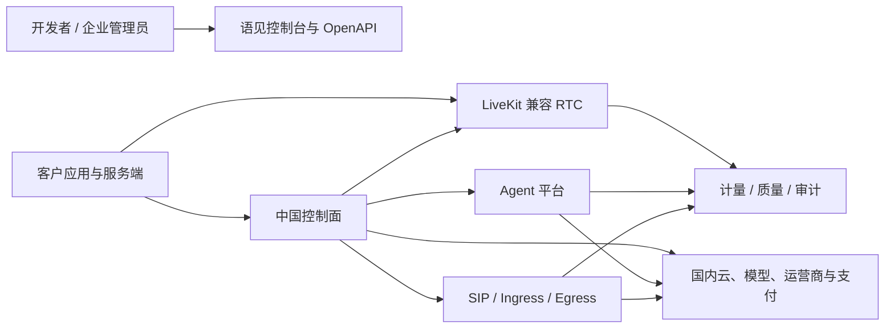

# 平台边界

版本：v2.0  
日期：2026-07-17  
状态：设计评审稿

## 1. 决策摘要

语见AI采用“LiveKit 兼容核心 + 中国本土控制面 + Agent 平台 + 企业交付”的边界：

- LiveKit 上游负责 Room、Participant、Track、SFU、Token grant、SIP、
  Ingress、Egress 和 Agent dispatch 的核心语义。
- 语见控制面负责租户、项目、环境、API key、区域、配额、套餐、账单、审计、
  部署和支持。
- 语见 Agent 平台负责 worker 制品、版本、部署、灰度、模型插件、工具策略和 trace。
- 国内云、身份、支付、发票、短信、对象存储和模型由 adapter 接入。
- 上游扩展必须最小化，并与 `yujian.*` 专有合同隔离。

## 2. 系统上下文

## 3. 权威职责

| 领域 | 权威系统 | 说明 |
| --- | --- | --- |
| 租户、成员、角色 | 语见控制面 | 不写入 LiveKit metadata 作为唯一真值 |
| 项目、环境、区域策略 | 语见控制面 | 决定 endpoint、配额和数据驻留 |
| API key 与 secret | 语见控制面/KMS | secret 仅在创建时返回，服务端保存不可逆或加密表示 |
| Room 实时状态 | LiveKit RTC | Room/Participant/Track 使用上游语义 |
| Room 产品配置 | 语见控制面 | 保留时间、区域、配额、Webhook 和 Agent 默认规则 |
| Token grant | LiveKit 兼容合同 | 由语见 Token API 签发，不把 API secret 下发客户端 |
| Agent worker 版本与部署 | 语见 Agent 控制面 | dispatch 实际执行使用 LiveKit Agents 能力 |
| SIP trunk 与号码配置 | 语见电话控制面 | 实时 SIP participant 状态由 LiveKit SIP 提供 |
| Ingress/Egress 任务 | LiveKit 服务 + 语见控制面 | 上游任务状态为执行真值，语见保存租户关联和计量 |
| 套餐、配额、账单 | 语见计费域 | 不以客户端事件直接入账 |
| 用量、质量、审计 | 语见数据面 | 原始指标与结算记录分层保存 |

## 4. 接口边界

### 4.1 LiveKit 兼容接口

首版兼容范围：

- JWT access token 与 VideoGrant。
- RoomService、AgentDispatchService、Ingress、Egress 和 SIP 服务的目标版本子集。
- WebSocket signal、WebRTC media、Data Packet/Data Stream/RPC。
- Webhook 事件的目标版本子集。
- JavaScript、Flutter、iOS、Android、Python 和 Node.js SDK 的基准版本。

兼容不等于一次性复制全部 LiveKit Cloud 产品能力。每个能力必须在兼容矩阵中标记：

- `compatible`
- `compatible_with_limit`
- `yujian_extension`
- `not_supported`

### 4.2 语见平台接口

以下能力使用独立 `/platform/v1` API：

- tenant、member、role
- project、environment、region policy
- api key、token issuer policy
- quota、plan、usage、invoice
- agent artifact、deployment、rollout、provider binding
- private deployment、license、support bundle

语见事件统一使用 `yujian.*` 前缀，例如：

- `yujian.project.quota_exceeded.v1`
- `yujian.agent.deployment_ready.v1`
- `yujian.billing.usage_finalized.v1`

### 4.3 客户端边界

客户端可以：

- 调用客户自己的后端换取短期 Room token。
- 连接分配到的 LiveKit endpoint。
- 使用兼容 SDK 加入 Room、发布和订阅 Track。
- 在 grant 允许范围内发送数据和 RPC。

客户端不得：

- 持有 LiveKit API secret 或语见平台 secret。
- 直接调用内部管理端口、Redis、数据库、KMS 或模型服务。
- 自报可结算用量。
- 伪造管理员或 Agent worker 身份。

## 5. 上游与语见扩展边界

### 5.1 上游优先

下列能力原则上不自研替代：

- SFU、ICE、TURN、带宽估计和拥塞控制。
- 主流客户端 SDK 的媒体协议实现。
- SIP、Ingress、Egress 核心媒体流程。
- Agent dispatch 基本模型。

### 5.2 允许扩展

只在以下情况增加语见实现：

- 中国区域路由、数据驻留和网络诊断。
- 国内云与企业身份、存储、KMS、日志、支付和模型 provider。
- 租户、套餐、计费、合同、发票和企业运维。
- 私有化安装、升级、许可、巡检和支持包。
- 上游尚无能力且无法通过 adapter 完成的中国市场需求。

### 5.3 禁止扩展方式

- 静默修改上游协议字段语义。
- 使用同名 API 返回不兼容结构。
- 把专有字段塞入上游保留字段。
- 让官方 SDK 必须打补丁才能连接基础 RTC。
- 形成无法定期合并上游安全修复的大型 fork。

## 6. 外部系统边界

| 外部系统 | 接入方式 | 约束 |
| --- | --- | --- |
| 国内云 IaaS/Kubernetes | Terraform/Helm/Operator adapter | 不在核心合同写死厂商 |
| 对象存储与 CDN | S3 兼容或 provider adapter | 数据驻留和生命周期可配置 |
| KMS/Secret Manager | envelope encryption adapter | secret 不落普通配置表 |
| 身份与 SSO | OIDC/SAML/SCIM | 企业版可选，本地账号保底 |
| LLM/ASR/TTS/VLM | Agent provider plugin | 记录区域、版本、费用和数据策略 |
| SIP trunk/号码 | provider adapter | 资质、实名、号码和区域规则外置 |
| 支付与发票 | billing adapter | 交易与技术用量账本分离 |
| 内容安全 | moderation adapter | 按产品场景、区域和客户策略启用 |

## 7. 合规边界

以下内容是设计要求，不代表已经取得许可或完成备案：

- 处理个人信息遵守《个人信息保护法》的告知、同意、最小必要和权利响应要求。
- 网络数据处理遵守《网络数据安全管理条例》和适用的数据安全要求。
- 互联网信息服务、增值电信业务、号码和公众电话能力在商用前完成适用的许可评审。
- 面向公众提供生成式 AI 或拟人化交互时，按实际功能评估算法、内容标识、安全评估
  和未成年人保护义务。

正式上线前必须由法律、合规、运营商和安全负责人形成书面结论。

## 8. 参考资料

- [LiveKit overview](https://docs.livekit.io/intro/overview/)
- [LiveKit tokens and grants](https://docs.livekit.io/frontends/reference/tokens-grants/)
- [LiveKit self-hosting](https://docs.livekit.io/transport/self-hosting/)
- [LiveKit agent dispatch](https://docs.livekit.io/agents/server/agent-dispatch/)
- [个人信息保护法](https://www.npc.gov.cn/npc/c2/c30834/202108/t20210820_313088.html)
- [网络数据安全管理条例](https://app.www.gov.cn/govdata/gov/202409/30/520076/article.html)
- [互联网信息服务管理办法](https://www.miit.gov.cn/zwgk/zcwj/flfg/art/2020/art_4c6a91eb93c34a6e8adc5852f9b56fd1.html)

