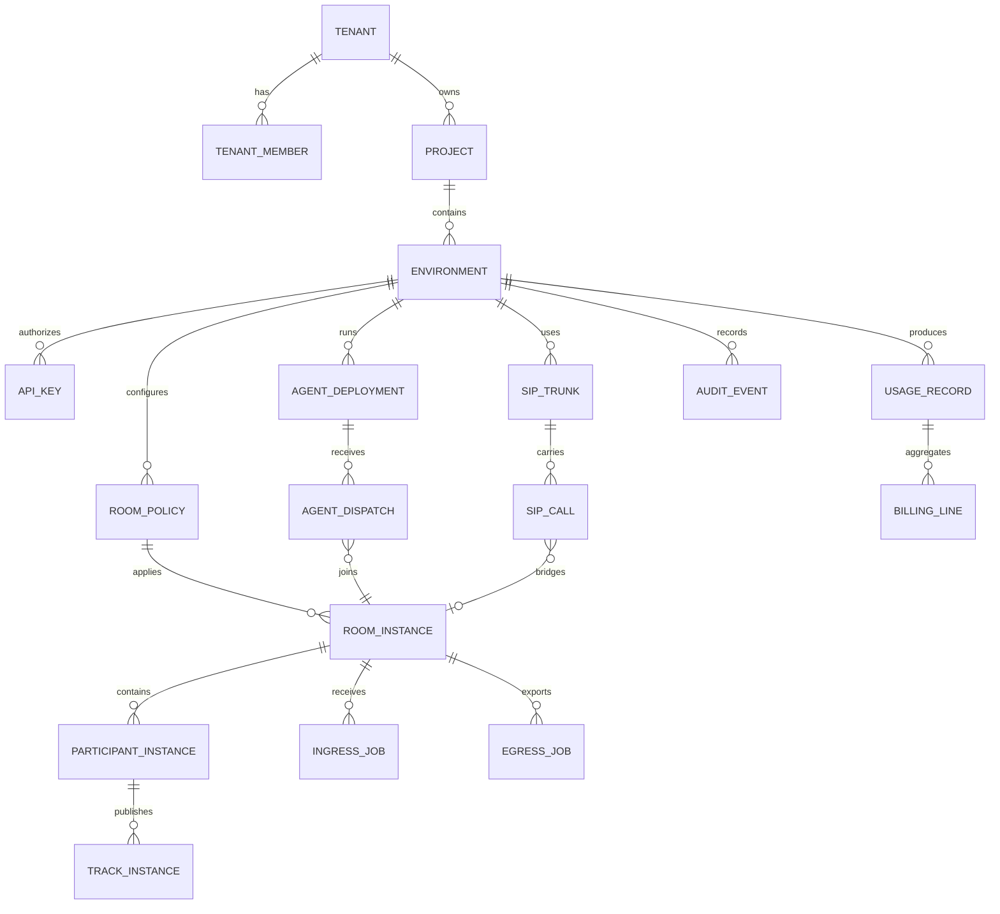

# 统一数据模型

版本：v2.0  
日期：2026-07-17  
状态：合同设计评审稿

## 1. 建模原则

1. 平台隔离根是 `tenantId`，资源归属必须可追溯到 tenant。
2. 开发边界是 `projectId`，运行边界是 `environmentId`。
3. Room、Participant、Track 等媒体对象保持 LiveKit 标识和语义。
4. 语见业务对象使用独立 ID，不用一个全局 session ID 覆盖所有领域。
5. 实时状态、控制面真值、分析数据和结算账本分开保存。
6. 外部 provider 标识不能替代语见主键。
7. 所有跨服务合同都显式携带 `schemaVersion`、时间和幂等信息。

## 2. 实体关系

## 3. 标识规范

| 对象 | 规范字段 | 来源 | 说明 |
| --- | --- | --- | --- |
| Tenant | `tenantId` | 语见 ULID/UUID | 平台隔离根 |
| Project | `projectId` | 语见 ULID/UUID | 产品或业务项目 |
| Environment | `environmentId` | 语见 ULID/UUID | `dev/test/staging/prod` 等 |
| API key | `apiKeyId` | 语见 | 展示 ID，不等于 secret |
| Room | `roomName`, `roomSid` | LiveKit | name 由客户指定，SID 由 RTC 分配 |
| Participant | `participantIdentity`, `participantSid` | LiveKit | identity 在 Room 内唯一 |
| Track | `trackSid` | LiveKit | 不另造语见 Track ID |
| Agent deployment | `agentDeploymentId` | 语见 | 指向 agent name/version/artifact |
| Agent dispatch | `agentDispatchId` | LiveKit/映射表 | 保留上游 dispatch ID |
| SIP trunk | `sipTrunkId` | 语见 + 上游映射 | secret 分离保存 |
| SIP call | `sipCallId` | 语见 | 关联 provider call ID 和 participant SID |
| Ingress | `ingressId` | LiveKit | 保留上游 ID |
| Egress | `egressId` | LiveKit | 保留上游 ID |
| Usage | `usageRecordId` | 语见 | 不可变原子用量记录 |
| Invoice | `invoiceId` | 商务系统/语见映射 | 与用量账本解耦 |
| Audit | `auditEventId` | 语见 | 不可变安全审计记录 |

## 4. 控制面实体

### 4.1 Tenant

关键字段：

- `tenantId`
- `displayName`
- `status`: `trial | active | suspended | closing | closed`
- `dataResidencyPolicy`
- `planId`
- `billingAccountId`
- `createdAt`, `updatedAt`

规则：

- tenant 停用后不得签发新 token 或创建新任务。
- 资源删除采用状态迁移和保留期，不直接物理级联。
- 数据驻留策略变更需要审批和迁移计划。

### 4.2 Project

关键字段：

- `projectId`
- `tenantId`
- `name`
- `slug`
- `status`
- `defaultRegionPolicyId`
- `createdAt`, `updatedAt`

`slug` 仅用于可读路径，不能作为外键或安全边界。

### 4.3 Environment

关键字段：

- `environmentId`
- `projectId`
- `type`
- `endpoint`
- `regionPolicyId`
- `quotaPolicyId`
- `retentionPolicyId`
- `status`

生产与非生产环境必须使用不同 API key、用量和数据保留策略。

### 4.4 API key

关键字段：

- `apiKeyId`
- `environmentId`
- `keyPrefix`
- `secretCiphertext` 或 `secretHash`
- `scopes`
- `status`
- `expiresAt`
- `lastUsedAt`

secret 只在创建时返回一次；轮换期间允许短暂双 key。

## 5. RTC 实体

### 5.1 RoomPolicy

RoomPolicy 是控制面配置，不是正在运行的 Room：

- `emptyTimeoutSeconds`
- `maxParticipants`
- `maxPublishers`
- `enabledCodecs`
- `recordingPolicy`
- `agentDispatchPolicy`
- `webhookPolicy`
- `metadataSizeLimit`

### 5.2 RoomInstance

RoomInstance 是对 LiveKit Room 生命周期的可查询投影：

- `environmentId`
- `roomName`
- `roomSid`
- `region`
- `createdAt`
- `endedAt`
- `closeReason`
- `policySnapshot`

不得用投影表控制实时 Room；创建、列举和关闭仍通过兼容 Server API。

### 5.3 ParticipantInstance

- `roomSid`
- `participantIdentity`
- `participantSid`
- `kind`
- `joinedAt`, `leftAt`
- `disconnectReason`
- `sourceIpHash`
- `clientInfo`

用户正文、SDP、完整 IP 和 token 不进入常规分析表。

### 5.4 TrackInstance

- `trackSid`
- `participantSid`
- `kind`
- `source`
- `codec`
- `publishedAt`, `unpublishedAt`
- `qualitySummary`

Track 统计是诊断投影，不是计费唯一来源。

## 6. Agent 实体

### 6.1 AgentArtifact

- `agentArtifactId`
- `tenantId`
- `runtime`: `python | node`
- `digest`
- `sbomUri`
- `signature`
- `createdBy`
- `scanStatus`

### 6.2 AgentDeployment

- `agentDeploymentId`
- `environmentId`
- `agentName`
- `version`
- `artifactId`
- `desiredReplicas`
- `minReplicas`, `maxReplicas`
- `rolloutStrategy`
- `providerBindings`
- `status`

### 6.3 AgentDispatch

- `agentDispatchId`
- `agentDeploymentId`
- `roomName`, `roomSid`
- `participantIdentity`
- `dispatchRuleId`
- `requestedAt`, `acceptedAt`, `finishedAt`
- `result`
- `failureCategory`

dispatch metadata 必须有大小、敏感字段和保留时间限制。

### 6.4 ProviderBinding

- `providerBindingId`
- `environmentId`
- `capability`: `llm | realtime_model | asr | tts | vlm | moderation`
- `provider`
- `model`
- `region`
- `secretRef`
- `dataPolicy`
- `timeoutPolicy`
- `costPolicy`

## 7. SIP 与媒体任务

### 7.1 SipTrunk

- `sipTrunkId`
- `environmentId`
- `direction`
- `provider`
- `region`
- `numberRefs`（KMS/provider reference 或不可逆 hash，不保存完整号码）
- `credentialRef`
- `allowedDestinationPrefixes`
- `secureTransport`, `fraudPolicyRef`, `dispatchRuleRef`
- `maxConcurrentCalls`, `maxCallsPerMinute`, `maxDailyCostMicros`
- `status`

### 7.2 SipCall

- `sipCallId`
- `sipTrunkId`
- `providerCallId`
- `roomName`, `roomSid`
- `participantSid`
- `direction`
- `fromMasked`, `toMasked`
- `status`
- `startedAt`, `answeredAt`, `endedAt`
- `terminationReason`

完整号码必须加密并与普通查询表分离。

### 7.3 IngressJob / EgressJob

保留上游 `ingressId`、`egressId` 和状态，附加：

- `tenantId`, `projectId`, `environmentId`
- `requestedBy`
- `policySnapshot`
- `storageTargetRef`
- `usageAggregationKey`
- `retentionUntil`

## 8. 用量、账单和审计

### 8.1 UsageRecord

UsageRecord 是不可变的原子计量事实：

- `usageRecordId`
- `tenantId`, `projectId`, `environmentId`
- `resourceType`
- `resourceId`
- `metric`
- `quantity`
- `unit`
- `windowStart`, `windowEnd`
- `source`
- `dedupeKey`
- `finalizedAt`

计量来源必须是服务端信号、媒体统计或 provider 账单，不接收客户端自报结算量。

### 8.2 BillingLine

BillingLine 是费率应用后的结果：

- `billingLineId`
- `usageRecordId` 或聚合范围
- `priceVersion`
- `quantity`
- `unitPrice`
- `amount`
- `currency`
- `adjustmentReason`

用量不可变，冲正使用新记录，不覆盖旧记录。

### 8.3 AuditEvent

- `auditEventId`
- `tenantId`
- `actorType`, `actorId`
- `action`
- `resourceType`, `resourceId`
- `requestId`
- `sourceIpHash`
- `result`
- `riskLevel`
- `occurredAt`

审计不得记录 secret、token、完整媒体内容或高敏工具参数。

## 9. 数据分层

| 数据层 | 建议存储 | 内容 | 特性 |
| --- | --- | --- | --- |
| 控制面真值 | PostgreSQL | tenant、project、key、deployment、plan | 强一致、事务 |
| 实时协调 | Redis | 路由、锁、短期状态、限流 | 可过期、非业务真值 |
| RTC 实时状态 | LiveKit | Room/Participant/Track | 上游接口访问 |
| 分析与用量 | ClickHouse 等 | 质量、用量、trace 索引 | 高吞吐、可重算 |
| 对象数据 | 对象存储 | 录制、日志包、Agent artifact | 生命周期与加密 |
| 审计账本 | PostgreSQL/不可变存储 | 管理动作和高风险操作 | 防篡改与留存 |

## 10. 删除与保留

- Room 实时状态随生命周期结束；控制面投影按诊断策略保留。
- 媒体内容默认不保存，录制必须显式配置和授权。
- 质量数据与账单数据采用不同保留策略。
- 账号关闭执行冻结、导出、结算、延迟删除和销毁证据。
- 私有部署的数据保留由客户配置，但最低安全审计要求写入合同。
