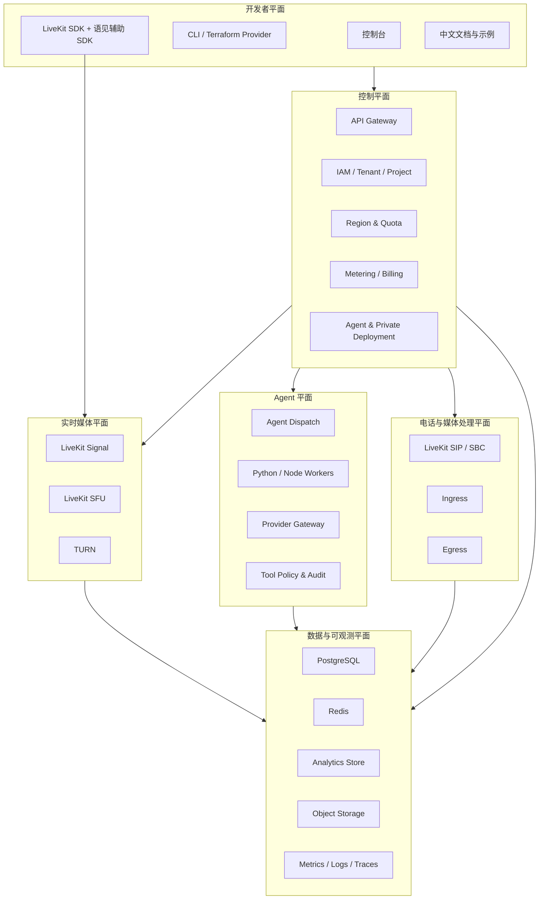

# 技术架构

版本：v2.0  
日期：2026-07-17  
状态：设计评审稿

## 1. 架构目标

- 对目标 LiveKit 版本保持可验证兼容。
- 在中国大陆提供可运营的多租户控制面和区域服务。
- 将 RTC、Agent、SIP/媒体处理与平台业务解耦。
- 同时支持托管云、专有云和私有部署。
- 通过最小 fork 和自动化上游同步控制长期维护成本。

## 2. 六个平面



## 3. 开发者平面

### 3.1 控制台

首版模块：

- tenant/project/environment
- API key 与 token helper
- endpoint、region 和网络诊断
- Room 与 participant 观测
- Agent artifact/deployment/trace
- SIP trunk、Ingress/Egress
- usage、quota、billing 和 audit
- private deployment 与 support bundle

控制台只调用公开或内部受保护的控制面 API，不直接连接数据库或 LiveKit admin secret。

### 3.2 SDK 策略

- 基础 RTC 优先直接兼容官方 LiveKit SDK。
- 语见辅助 SDK 只提供 endpoint discovery、token exchange、region policy、
  telemetry opt-in 和控制面 API。
- 不 fork 所有客户端 SDK；只有上游无法接受且中国平台必需的修改才形成补丁。
- 后续按需求增加 HarmonyOS 和小程序适配层，不能承诺与浏览器 WebRTC 完全同构。

## 4. 控制平面

### 4.1 API Gateway

职责：

- TLS termination、WAF、认证、限流、request ID 和审计。
- REST/gRPC 路由与 payload 上限。
- tenant/environment 上下文注入。

不负责：

- 业务权限最终判断。
- RTC 媒体转发。
- 长任务执行。

### 4.2 IAM 与资源服务

建议初期采用模块化单体或少量服务，避免过早微服务化：

- Identity & Tenant
- Project & Environment
- Credential
- Quota & Region
- Audit

模块边界通过数据库 schema、领域接口和事件定义约束；只有独立扩容或隔离需求明确后
再拆服务。

### 4.3 Region Router

输入：

- environment region policy
- 客户指定 region
- 客户端网络探测
- 区域健康与容量
- 数据驻留约束

输出：

- LiveKit WebSocket endpoint
- TURN endpoint
- token audience/region claim
- fallback policy

region 选择结果写入审计和质量上下文，但不得暴露内部节点地址。

### 4.4 Quota 与 Billing

热路径配额采用本地缓存/Redis 令牌和最终账本结合：

1. 控制面保存 entitlement。
2. 区域服务获取签名配额快照。
3. 热路径进行快速准入。
4. 服务端生成原子 usage record。
5. 聚合器应用价格版本并生成 billing line。
6. 对账任务比较上游、媒体统计和 provider 账单。

## 5. 实时媒体平面

### 5.1 LiveKit Server

语见发行版保持：

- Room/Participant/Track 语义。
- signal 与 WebRTC 协议兼容。
- Redis 路由和多节点部署模式。
- Prometheus 指标与标准健康接口。

语见 patch 只用于无法通过外围组件实现的区域、运维或安全需求，并维护独立 patch
清单。

### 5.2 TURN

- UDP 优先，TCP/TLS 作为回退。
- 按运营商和区域观测 relay 比例、建立耗时和失败率。
- TURN credential 短期签发。
- 容量与 LiveKit 节点分开规划，避免弱网时同时过载。

### 5.3 多区域

首版 Room 固定在创建区域，不做跨区域 SFU mesh。region router 选择最佳区域；区域
故障后的策略分为：

- 新 Room 切换健康区域。
- 未建立连接的客户端重新取 endpoint/token。
- 已运行 Room 不承诺无缝跨区域迁移，除非上游能力和验收已覆盖。

## 6. Agent 平面

### 6.1 Agent Control

- artifact registry
- deployment desired state
- rollout/rollback
- provider binding
- dispatch rule
- secret reference
- policy and audit

Agent Control 的状态机以 `AgentControlSnapshot` 作为可恢复边界；生产通过
`YUJIAN_AGENT_CONTROL_PERSISTENCE_MODULE` 注入 PostgreSQL snapshot adapter，迁移由
`003_agent_control.sql` 建表。worker credential 与管理 credential 分离，生产缺少任一安全
边界时不启动；`YUJIAN_AGENT_ARTIFACT_VERIFIER_MODULE` 注入部署侧 OCI 签名/SBOM verifier，
缺少 verifier 时不接受 artifact。

平台 Tenant/Project/Environment/API key 等控制面资源以 `PlatformStoreSnapshot` 作为恢复边界；
生产 runtime 通过 `storePersistence` 注入 PostgreSQL adapter，使用 `006_platform_store.sql`，
并在 mutation 响应前持久化。快照只保存 API key hash，不保存明文 secret。

### 6.2 Worker Runtime

优先兼容 LiveKit Agents Python/Node 生命周期：

- worker 注册
- job request/accept
- process/room lifecycle
- graceful drain
- health and capacity

Node worker 使用官方 `@livekit/rtc-node`，Python worker 使用官方 `livekit.rtc.Room`；两者
只接收控制面签发的短期 Room token，不持有 LiveKit API secret。语见的 dispatch runner 负责
deadline、取消、drain 和 complete/fail 回写，provider/model 通过部署侧 adapter 注入。

语见增加：

- 国内镜像与包源。
- 国内模型 provider plugin。
- 制品签名、SBOM、租户隔离和配额。
- rollout、trace、成本和质量观测。

### 6.3 Model Provider Gateway

Gateway 只承担统一认证、路由、配额、超时、成本和审计，不强迫所有实时音频都绕行
中央代理。对低延迟实时模型，可以使用受策略约束的直连 worker adapter。

能力合同：

- `realtime_model`
- `llm`
- `asr`
- `tts`
- `vlm`
- `moderation`

本版本不包含机器翻译能力线。

### 6.4 Tool Gateway

工具调用分级：

- L0：只读低风险。
- L1：受限写入，可幂等回滚。
- L2：资金、账号、外呼等高风险，需要显式授权。
- L3：禁止自动执行或需要人工审批。

每次调用记录 policy version、授权、幂等键、输入摘要、结果和错误，不记录无必要的
用户正文。

## 7. SIP、Ingress 与 Egress

### 7.1 SIP

架构链路：

```text
Carrier / SIP Provider
        |
SBC / ACL / Fraud Control
        |
LiveKit SIP
        |
LiveKit Room / Agent
```

外呼前执行：

- tenant entitlement
- 号码与目的地区策略
- 频率、并发和费用上限
- 用户授权和高风险审计
- provider 可用性

### 7.2 Ingress/Egress

- Ingress/Egress 采用上游服务，语见控制面负责租户映射、配额、存储策略和用量。
- 录制默认关闭；开启时保存 policy snapshot、操作人和保留期限。
- 对象存储使用临时凭据或服务身份，不在任务 metadata 中放长期 secret。

## 8. 数据架构

### 8.1 PostgreSQL

保存：

- tenant/project/environment
- key metadata 与 encrypted secret reference
- quota/plan/price version
- agent artifact/deployment
- provider binding
- SIP configuration metadata
- audit/outbox

不保存：

- 高频 RTP/RTC 原始统计。
- 原始音视频流。
- 大体积 Agent trace 正文。

### 8.2 Redis

保存：

- LiveKit 上游所需分布式状态。
- 短期 endpoint/region cache。
- rate limit、lease、lock 和 worker capacity。

Redis 丢失不能造成账单、套餐或 tenant 归属永久丢失。

### 8.3 分析与对象存储

- 分析仓保存质量窗口、用量、trace 索引和聚合。
- 对象存储保存录制、导出、Agent artifact 和支持包。
- 访问通过短期签名 URL、服务身份和 tenant prefix 隔离。

## 9. 可靠性

- 控制面写操作使用事务、outbox 和幂等键。
- Webhook 使用签名、重试、退避、死信和 replay。
- Agent deployment 使用 generation 和 desired/observed state。
- 用量记录不可变，重复由 dedupe key 消除。
- 外部 provider 统一设置 timeout、circuit breaker、并发和 fallback。
- shutdown 使用 drain：停止新 Room/job、等待上限、取消并记录未完成任务。

## 10. 安全

- 所有 secret 存入 KMS/Secret Manager，不进入日志和事件。
- 内部服务使用 workload identity 和最小权限。
- tenant/project/environment 在每个数据访问层强制校验。
- LiveKit API secret 仅存在 token issuer 和管理 adapter。
- Agent artifact 必须扫描、签名并限制 egress 网络。
- SIP 和外呼增加反欺诈、目的地区和费用熔断。
- 支持包默认脱敏，并由客户确认后导出。

## 11. 上游同步架构

```text
livekit upstream tag
        |
mirror + license/SBOM scan
        |
clean compatibility branch
        |
apply yujian patch queue
        |
protocol/SDK/media regression
        |
nightly -> preview -> stable
```

禁止直接在 stable 分支上长期累积无来源 patch。每个 patch 必须记录：

- upstream issue/PR
- 中国平台必要性
- 影响的兼容面
- 测试和回滚
- 是否计划回馈上游

## 12. 部署

### 托管云

- Kubernetes 多可用区。
- 区域独立 RTC/TURN 和数据驻留。
- 控制面可跨区，媒体面默认不跨区。
- GitOps、签名镜像、渐进发布和自动回滚。

### 私有化

- 最小可用拓扑和高可用拓扑分别定义。
- 依赖采用兼容矩阵，不隐式调用语见公网。
- license/telemetry 可离线，客户可以禁用非必要遥测。
- 升级前执行备份、容量和兼容性预检。

## 13. 技术决策门

开发前必须冻结：

1. LiveKit server/protocol/SIP/Ingress/Egress/Agents 基准 commit 或 tag。
2. 首批官方 SDK 版本矩阵。
3. 上游 fork、mirror 和 patch queue 工作流。
4. ID 格式、控制面 API 和事件信封。
5. 首个托管区域与私有化最低拓扑。
6. PostgreSQL、Redis、分析仓和对象存储选型。
7. 许可、备案、SIP 和生成式 AI 功能的适用性结论。
