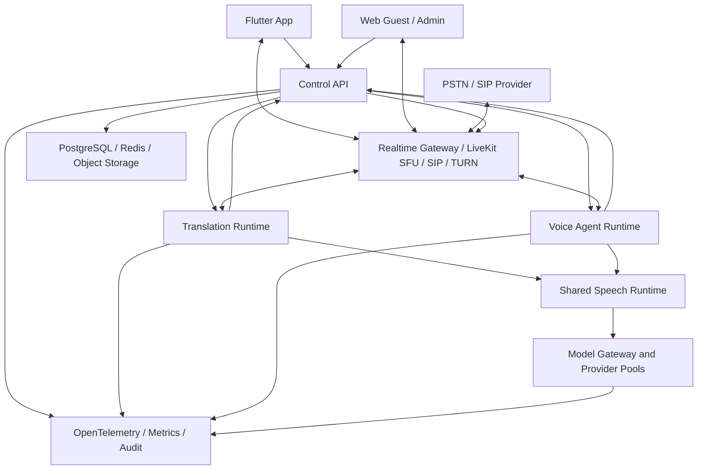
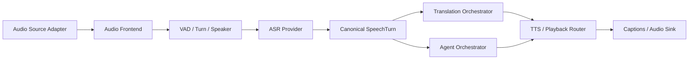
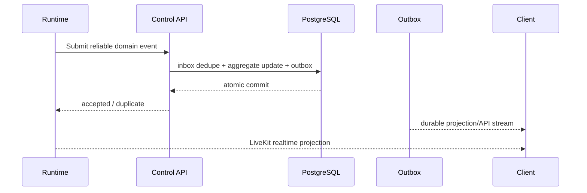
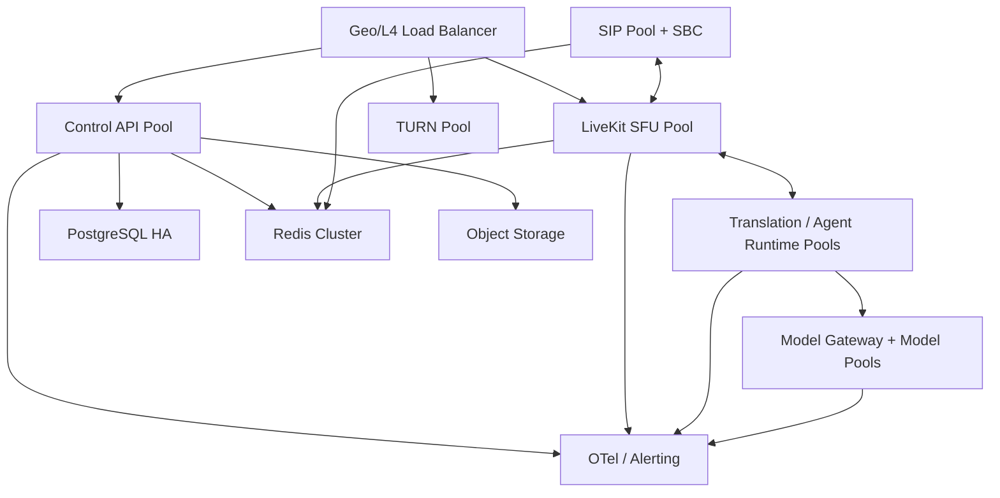

# 语见AI技术架构（翻译方向历史归档）

> 已于 2026-07-17 被“中国 LiveKit 类实时平台”目标取代，不再作为现行架构。

版本：v1.0  
日期：2026-07-17  
状态：设计评审稿，尚未开发

## 1. 架构目标

- 一个 `communicationSessionId` 贯穿面对面、聆听、Call Link、PSTN、Agent、
  历史、审计和计费。
- 业务真值、媒体状态、模型运行和客户端状态分离。
- Translation Runtime 与 Agent Runtime 独立演进，共用 Speech Runtime 能力。
- 利用 LiveKit 官方媒体、SIP、SDK 和 Agent Server 能力，不重新实现 WebRTC/SFU。
- 允许从无界AI迁移经过审计的业务源码，但不继承旧路径、旧密钥、旧状态真值和旧品牌。
- 所有关键路径具有容量准入、超时、取消、幂等、降级、可观测和回滚。

非目标：

- 不 fork 整个 LiveKit 生态。
- 不把所有服务合并成一个巨型进程。
- 不让 LiveKit room 状态替代业务 session。
- 不在生产客户端中做模型测试。

## 2. 系统上下文



## 3. 四个平面

### 3.1 控制面

Control API 是以下状态的权威入口：

- 账号、组织、设备和授权。
- Communication Session、participant、media leg 和状态转换。
- Call Link、Guest ticket、LiveKit token 和 Agent Dispatch。
- PSTN trunk 选择、拨号策略、号码风险和 provider operation。
- Agent task/run、工具授权、接管和结果。
- 用量 hold、账本、退款和查询。
- 历史、删除、导出和合规审计。

控制面不处理连续 PCM，不直接加载模型。

### 3.2 媒体面

| 场景 | 媒体入口 |
| --- | --- |
| 面对面/聆听端侧 | 本机音频管线 |
| 面对面/聆听云端 | Realtime Gateway 长连接 |
| Call Link/会议 | LiveKit Room |
| PSTN/Agent 电话 | LiveKit Room + LiveKit SIP |
| 外部直播输入 | P3 LiveKit Ingress |

LiveKit Room 由 room name 标识，业务层通过 `livekit_room_bindings` 映射到
`communicationSessionId`。Room 可重建，业务 session 不随之更换。

### 3.3 运行时平面



Speech Runtime 是逻辑共享层，首期实现为可复用包和 Provider Contract，不单独建立
一个处理所有 PCM 的中心服务。这样 Translation/Agent job 可以共享实现，又避免
中央 Speech 服务成为热路径瓶颈。

### 3.4 数据与模型平面

- PostgreSQL：业务真值、事务、唯一约束、账本、inbox/outbox。
- Redis：LiveKit 分布式路由、SIP/Ingress/Egress 协调、短期租约、限流和缓存。
- Object Storage：经授权录音、声音参考、导出和诊断证据。
- Model Gateway：Provider 选择、模型版本、容量、超时、fallback 和用量。
- GPU/CPU Pools：ASR、MT、TTS、LLM、Speaker 分开配额和故障域。

## 4. 组件职责

| 组件 | 权威职责 | 禁止职责 |
| --- | --- | --- |
| `apps/mobile` | 产品交互、采集、播放、端侧 Provider | 直接访问数据库、Redis、模型 secret |
| `apps/web` | Guest 入房、字幕、译音、Admin | 生成 LiveKit secret token |
| `control-api` | session、授权、计费、策略、历史 | 实时音频处理 |
| `realtime-gateway` | 单设备云端音频接入和瞬时事件 | 账本和长期历史真值 |
| `translation-runtime` | 忠实翻译和定向译音 | 自主工具调用 |
| `voice-agent-runtime` | 对话、工具、接管、结果 | 修改原始转写/忠实译文 |
| `model-gateway` | 模型路由、容量和 Provider 合同 | 产品授权和账本 |
| LiveKit Server | Room、track、data、WebRTC、TURN | 业务 session 和计费 |
| LiveKit SIP | SIP/RTP、trunk、participant、DTMF | 业务拨号策略和退款 |
| Egress | 经授权录音/导出 | 决定是否允许录音 |

## 5. LiveKit采用映射

| 官方能力 | 语见AI采用方式 |
| --- | --- |
| `livekit/livekit` | 固定版本官方镜像，作为 SFU 和 Room Service |
| `client-sdk-flutter` | Flutter App 的 Room/track/data/reconnect SDK |
| `client-sdk-js` | Web Guest 的 Room/track/data SDK |
| `node-sdks` | token、Room、Dispatch、SIP、Webhook 和 RTC |
| `agents-js` | Translation/Agent job 外壳、隔离进程、idle process、load、drain |
| `sip` | 自托管 SIP bridge 或官方兼容服务 |
| `protocol` | 通过 SDK 使用，不复制 protobuf 为业务合同 |
| `egress` | 录音/导出开关打开后独立部署 |
| `ingress` | P3 外部媒体接入，首版不部署 |

显式 Agent Dispatch 是默认方式。自动 dispatch 会对每个新 room 启动 agent，缺少
业务选择和 job metadata 控制，不适合作为产品主路径。

## 6. 运行模式

| mode | 媒体 | runtime profile |
| --- | --- | --- |
| `face_to_face` | local 或 gateway | translation |
| `listen` | local 或 gateway | translation |
| `call_link` | LiveKit | translation |
| `pstn_translation` | LiveKit + SIP | translation |
| `agent_assist` | gateway/LiveKit/SIP | translation_agent |
| `agent_call` | LiveKit + SIP | agent |
| `meeting` | gateway/LiveKit | speaker_translation |

Control API 根据 mode 生成不可由客户端篡改的 runtime profile。

## 7. LiveKit身份和业务身份

```text
communicationSessionId
  -> livekitRoomBinding(roomName, roomSid)
      -> participantBinding(participantId, livekitIdentity, participantSid)
          -> mediaLeg(legId, trackSid, transport)
```

- `participantId` 是业务身份。
- LiveKit `identity` 只在单个 room 内唯一。
- `participantSid` 和 `trackSid` 是 provider binding。
- Worker/Runtime 是 LiveKit programmatic participant，但不是业务人类 participant；
  其运行记录进入 runtime job/provider operation。

## 8. 数据和事件架构



LiveKit data channel用于即时显示，不用于持久化承诺。final 事件可以同时：

1. 以 data packet 快速显示。
2. 以可靠 API 命令提交 Control API。
3. 由 PostgreSQL outbox 形成可恢复历史。

客户端断线后通过 session snapshot 和 `lastSequence` 补齐，不依赖 LiveKit 重放。

## 9. 部署拓扑

### 9.1 本地开发

```text
Developer Mac
  - Control API
  - PostgreSQL/Redis containers
  - LiveKit/SIP optional
  - mock or remote Model Gateway
  - isolated model-lab
```

开发默认使用假号码、mock SIP 和合成音频。

### 9.2 集成/内测

```text
Public TLS Gateway
  +-- Control API
  +-- LiveKit + TURN
  +-- LiveKit SIP
Private Network
  +-- Translation Runtime Pool
  +-- Agent Runtime Pool
  +-- Model Gateway and Models
  +-- PostgreSQL / Redis / Object Storage
```

Beelink 可作为模型评测/内测节点，不承担生产 SFU 和公网 SIP。

### 9.3 生产



SFU、SIP、Runtime、模型和数据库是不同故障域。GPU OOM 不得影响 SFU；Egress
失败不得终止实时会话。

## 10. 扩展和容量

- LiveKit 多节点使用 Redis 共享路由；一个 room 在一个 SFU node 承载。
- Agent Server 负载不能只使用 CPU，需合并 active jobs、ASR streams、GPU、
  MT/TTS queue 和内存。
- 过载在 admission 阶段拒绝或排队，不能接通后才发现无模型容量。
- Translation 与 Agent 使用独立队列和配额。
- PostgreSQL 通过 aggregate revision 和唯一键处理同 session 并发。
- 会后摘要、导出和 Egress 使用低优先级异步队列。

## 11. 安全架构

### 11.1 信任边界

- 公网：API、LiveKit Signal/TURN 和受限 SIP/SBC。
- 私网：Runtime、Model Gateway、PostgreSQL、Redis、对象存储管理面。
- 客户端：只持短期票据和当前 session 最小配置。

### 11.2 Token

- 使用官方 server SDK 生成 JWT。
- 人类 token 只允许 join、subscribe 和 microphone publish。
- `canPublishData=false`，禁止 camera/screen。
- 默认 TTL 120 秒，最大 300 秒。
- self-hosted 环境没有 Cloud token revocation，使用一次性 ticket、短 TTL、
  RemoveParticipant 和 API 拒绝再次签发组合控制。

### 11.3 数据

- 字幕正文不进入普通日志。
- 手机号保存 encrypted/hash/masked 三种形态。
- 录音和声音对象使用独立授权。
- Runtime job metadata 不包含号码明文、字幕或模型 secret。
- Webhook 必须验证签名和 body hash，并进入 inbox 去重。

## 12. 高可用与恢复

- API 无状态化，所有可恢复状态进入 PostgreSQL。
- Runtime job 崩溃后由 Control API reconciliation 判断重新 dispatch、降级或结束。
- 旧 playback 不在新 job 自动重播。
- LiveKit webhook 无投递保证，定期用 Room/SIP API reconciliation 校准 provider 状态。
- Redis 故障不能造成账本不可恢复。
- 结束流程采用 ending window：停止新输入、flush、等待可靠事件、结算、进入终态。

## 13. 技术选型

| 领域 | 选型 |
| --- | --- |
| Mobile | Flutter/Dart |
| Web | TypeScript + React |
| Control/Runtime | Node.js 24 LTS + TypeScript |
| Model Services | Python，仅用于模型 Provider |
| Media | LiveKit Server/SIP/TURN |
| Agent Job | LiveKit Agents Node.js |
| Database | PostgreSQL |
| Coordination | Redis |
| Object | S3-compatible storage |
| Contracts | JSON Schema + TypeScript/Dart/Python adapters |
| Observability | OpenTelemetry + Prometheus-compatible metrics |

## 14. 架构决策

| ADR | 决策 |
| --- | --- |
| ADR-001 | `communicationSessionId` 是唯一业务聚合根 |
| ADR-002 | LiveKit 是媒体和 job 平面，不是业务真值 |
| ADR-003 | Translation 与 Agent 分离，共用 Speech Runtime |
| ADR-004 | PostgreSQL 可靠事件；LiveKit data 只做实时投影 |
| ADR-005 | 显式 Agent Dispatch |
| ADR-006 | Node Agents 为主，Python 只做模型或特有能力 |
| ADR-007 | LiveKit 官方发布包/镜像优先，最小 fork 例外 |
| ADR-008 | 无界AI按模块迁移，不整库复制 |

## 15. 设计评审门槛

- 业务/媒体/运行时 ownership 无重叠真值。
- 每个外部 provider 都有 binding、幂等和 reconciliation。
- 所有公网入口具有权限和资源上限。
- 每个 Phase 都有回滚路径和验收证据。
- 评审通过前不开始源码迁移或实现。
