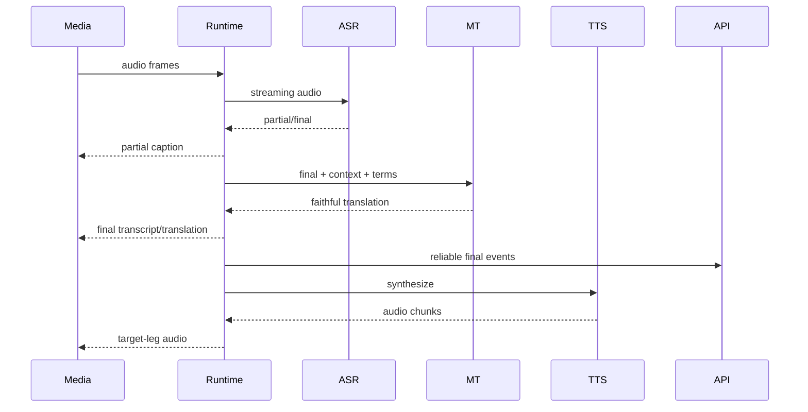

# 语见AI技术设计（翻译方向历史归档）

> 已于 2026-07-17 被“中国 LiveKit 类实时平台”目标取代，不再作为现行设计。

版本：v1.0  
日期：2026-07-17  
状态：设计评审稿，尚未开发

## 1. 目标和约束

本设计把功能设计和技术架构落实为模块、API、数据、事件、状态机和 LiveKit 接入
合同。它描述“如何开发”，但本阶段不创建服务、不复制旧源码、不部署 LiveKit。

约束：

- 先合同和测试，后跨模块实现。
- 所有对象使用 `communicationSessionId`。
- API 是业务写入权威；Runtime 不直连业务数据库。
- LiveKit data packet 不承担可靠历史。
- 单个 TypeScript、Dart、Python 文件默认不超过 350 行。

## 2. 目标仓库结构

```text
apps/
  mobile/                         Flutter App
  web/                            Guest + Admin
services/
  control-api/                    session/auth/billing/policy/query
  realtime-gateway/               direct websocket media adapter
  translation-runtime/            LiveKit/gateway translation jobs
  voice-agent-runtime/            LiveKit agent jobs and tools
  model-gateway/                  model routing and admission
packages/
  contracts/                      JSON Schema and language adapters
  domain/                         state machines and invariants
  speech-runtime/                 audio/VAD/turn/ASR/TTS abstractions
  translation-core/               terminology, direction and MT
  agent-core/                     policy, tools, handoff and results
  livekit-adapter/                SDK wrappers and provider bindings
  observability/                  trace, metrics and redaction
infra/
  livekit/                        pinned self-host templates
  environments/                   non-secret environment contracts
tests/
  contracts/
  integration/
  load/
  security/
  fixtures/
```

## 3. Control API

### 3.1 公共 API

| Method | Path | 作用 |
| --- | --- | --- |
| `POST` | `/v1/communication-sessions` | 创建业务会话 |
| `GET` | `/v1/communication-sessions/{id}` | 获取可恢复快照 |
| `POST` | `/v1/communication-sessions/{id}/admit` | 容量准入并创建媒体绑定 |
| `POST` | `/v1/communication-sessions/{id}/pause` | 暂停 |
| `POST` | `/v1/communication-sessions/{id}/resume` | 恢复 |
| `POST` | `/v1/communication-sessions/{id}/end` | 幂等结束 |
| `POST` | `/v1/communication-sessions/{id}/join-tickets` | 创建一次性入房票据 |
| `POST` | `/v1/join-tickets/{ticket}/exchange` | 换取短期 LiveKit token |
| `POST` | `/v1/call-links` | 创建分享链接 |
| `POST` | `/v1/pstn-calls` | 发起翻译电话 |
| `POST` | `/v1/agent-tasks` | 创建 Agent 草稿 |
| `POST` | `/v1/agent-tasks/{id}/authorize` | 授权并排队 |
| `POST` | `/v1/agent-runs/{id}/cancel` | 取消执行 |
| `POST` | `/v1/agent-runs/{id}/takeover` | 用户接管 |
| `POST` | `/v1/livekit/webhooks` | 接收 LiveKit webhook |

所有变更请求要求：

- `Idempotency-Key`。
- 认证 subject。
- 可选 `If-Match`/`expectedRevision`。
- 结构化审计 actor。

### 3.2 内部 API

Runtime 通过服务身份访问：

| Path | 作用 |
| --- | --- |
| `/internal/v1/runtime-jobs/{ticket}/snapshot` | 一次性获取 session/runtime 配置 |
| `/internal/v1/communication-sessions/{id}/events` | 提交可靠事件 |
| `/internal/v1/provider-operations/{id}` | 外部操作结果和对账 |
| `/internal/v1/runtime-jobs/{id}/heartbeat` | 运行时健康和容量 |
| `/internal/v1/playbacks/{id}/state` | playback 生命周期 |

job metadata 只携带 session ID、runtime profile、ticket ID 和 trace context，不携带
电话号码、字幕正文、用户 token 或模型凭据。

## 4. 数据模型

### 4.1 核心表

| 表 | 关键唯一约束 |
| --- | --- |
| `communication_sessions` | `id` |
| `session_participants` | `communication_session_id + participant_id` |
| `media_legs` | `communication_session_id + leg_id` |
| `livekit_room_bindings` | `room_name`；一个 active binding/session |
| `speech_turns` | `communication_session_id + turn_id` |
| `transcript_segments` | `segment_id + revision` |
| `translations` | `segment_id + revision + target_language` |
| `tts_playbacks` | `playback_id`；每 target leg 最多一个 active generation |
| `agent_tasks` | `agent_task_id` |
| `agent_runs` | `agent_run_id` |
| `tool_executions` | `agent_run_id + idempotency_key` |
| `provider_operations` | `provider + provider_operation_id` |
| `usage_holds` | `idempotency_key` |
| `billing_ledger` | append-only `ledger_entry_id` |
| `inbox_events` | `event_id` + payload hash |
| `outbox_events` | `idempotency_key` |

### 4.2 Session字段

```text
id UUID
mode ENUM
state ENUM
created_by_subject_id
source_language_tag
target_language_tags
runtime_profile
revision BIGINT
created_at / updated_at / ended_at
end_reason / failure_code
```

业务时间与 provider 时间分开：

- `created_at`：API 创建。
- `admitted_at`：容量/媒体准入成功。
- `answered_at`：PSTN 对端接听。
- `active_at`：产品主链路可用。
- `ended_at`：业务终态。

### 4.3 Provider binding

LiveKit、SIP 和模型返回的 SID/ID 不进入主键。统一保存在 binding/operation：

```json
{
  "provider": "livekit",
  "providerResourceType": "room",
  "providerResourceId": "RM_xxx",
  "providerIdentity": "opaque-room-name",
  "communicationSessionId": "uuid"
}
```

## 5. 状态机

### 5.1 Communication Session

允许：

- `created -> admitting|ending|failed`
- `admitting -> active|ending|failed`
- `active -> ending|failed`
- `ending -> ended|failed`

`ended`、`failed` 为终态。重复请求返回当前结果，不创建第二次结算。

### 5.2 Participant

```text
invited -> joining -> active -> left
    |         |          |
    +---------+----------+-> failed
```

LiveKit participant reconnect 不创建新的业务 participant，可创建新的 media leg。

### 5.3 Playback

```text
queued -> generating -> ready -> playing
                        |         |
                        +-> cancelled
                                  |
playing -> completed|interrupted|failed
```

- `generation` 对 target leg 单调增加。
- 迟到 audio chunk 的 generation 小于当前值时直接丢弃。
- `tts.ready` 不等于 `playback.started`。

### 5.4 Agent

`agent_task`：

```text
draft -> authorized -> queued -> cancelled
```

`agent_run`：

```text
created -> dispatching -> dialing -> disclosure -> active
       -> completed|failed|cancelled|handed_off
```

## 6. 事件设计

### 6.1 可靠事件

继续使用 `ReliableEventEnvelopeV1`，payload 在进入实现前逐事件冻结。

首批 payload：

- `communication.session.created.v1`
- `communication.session.state_changed.v1`
- `communication.participant.joined.v1`
- `communication.media_leg.connected.v1`
- `speech.transcript.final.v1`
- `speech.transcript.revised.v1`
- `translation.final.v1`
- `translation.revised.v1`
- `playback.completed|cancelled|failed.v1`
- `agent.task.authorized.v1`
- `agent.run.completed|failed.v1`
- `agent.tool.completed.v1`
- `billing.usage.committed.v1`

### 6.2 LiveKit实时 topic

| Topic | 传输 | 用途 |
| --- | --- | --- |
| `yujian.caption.partial.v1` | lossy | 当前临时字幕 |
| `yujian.caption.final.v1` | reliable packet | final 的即时投影 |
| `yujian.translation.final.v1` | reliable packet | 译文即时投影 |
| `yujian.playback.state.v1` | reliable packet | queued/started/interrupted |
| `yujian.runtime.status.v1` | reliable packet | 降级和恢复 |
| `yujian.audio.level.v1` | lossy | UI 波形/音量 |

规则：

- 每包不超过 15 KiB。
- 接收端验证 topic、sender identity/kind、schema 和
  `communicationSessionId`。
- 人类 token 不允许 publish data。
- final packet 丢失时由 API snapshot 补齐。

### 6.3 Webhook

LiveKit webhook：

1. 保留 raw body。
2. 官方 SDK 验证签名和 body hash。
3. 计算 payload hash，写 inbox。
4. 转换为 provider observation。
5. 与业务状态 reconciliation，不直接覆盖 session。
6. 返回 2xx 后异步处理。

Webhook 可能丢失，必须定时查询 Room/SIP 状态校准。

## 7. LiveKit Token和权限

| 身份 | publish | subscribe | publish data | sources |
| --- | --- | --- | --- | --- |
| Mobile Host | 是 | 是 | 否 | microphone |
| Web Guest | 是 | 是 | 否 | microphone |
| Observer | 否 | 是 | 否 | none |
| Translation Runtime | TTS audio | 是 | 是 | microphone/custom audio |
| Agent Runtime | Agent audio | 是 | 是 | microphone/custom audio |

所有 token：

- 绑定具体 room 和 participant identity。
- TTL 120 秒，最大 300 秒。
- 由一次性 ticket 换取。
- metadata/attributes 只放非敏感 opaque ID 和 role。
- API secret 只存在服务端 secret store。

## 8. Room与Dispatch

### 8.1 Room创建

Control API：

1. 创建业务 session。
2. 容量准入。
3. 生成不可猜测 room name。
4. 创建/记录 `livekit_room_binding`。
5. 根据 runtime profile 显式 dispatch。
6. 签发 participant ticket。

### 8.2 Runtime名称

- `yujian-translation-runtime`
- `yujian-voice-agent-runtime`
- `yujian-speaker-runtime`（后续可合并为 Translation job 的能力）

### 8.3 自托管恢复

Agent Dispatch 的 Cloud restart policy 不作为 self-hosted 保证。Control API
reconciler 依据 heartbeat、room participant 和 session 状态：

- 创建新 dispatch。
- 降级到字幕-only。
- 等待用户重连。
- 安全结束并释放 hold。

## 9. Speech Runtime合同

### 9.1 ASR

```text
createSession(config)
writeAudio(frame)
updateContext(language, hotwords)
events(partial, final, error)
flush(reason)
cancel()
close()
```

### 9.2 TTS

```text
start(request)
audioChunk(sequence, pcm16, sampleRate)
end(usage)
cancel(playbackId, generation)
```

### 9.3 VAD/Turn

- VAD probability 是瞬时数据。
- turn final 保存 endpoint reason、start/end、speaker evidence。
- Translation 使用低延迟 endpoint profile。
- Agent 可以增加语义 EOT，但受 min/max delay 限制。

### 9.4 Provider路由

每个 session 冻结：

- provider、model、version/fingerprint。
- timeout、fallback、语言和音频格式。
- 术语/提示词版本。
- 数据地区和隐私等级。

Provider 切换产生可靠 degraded/restored 事件和指标，不在每帧来回抖动。

## 10. Translation Runtime



关键规则：

- 同一 participant/turn 有序，方向之间可并行。
- partial 可合并/丢弃，final 不丢。
- 术语、数字、姓名、地址和型号保护。
- TTS 队列按 target leg 隔离。
- 结束先 flush，再 drain translation 和 playback。

## 11. Agent Runtime

模块：

- Context Builder。
- Policy Engine。
- Planner/LLM Adapter。
- Tool Registry/Executor。
- Response Renderer。
- Handoff Manager。
- Result Builder。

工具执行输入必须包含：

```json
{
  "toolExecutionId": "uuid",
  "toolName": "calendar.create",
  "schemaVersion": 1,
  "riskLevel": "L1",
  "authorizationId": "uuid",
  "idempotencyKey": "string",
  "arguments": {}
}
```

LLM 不持有 provider secret。Tool Executor 使用服务身份，输出先落审计再进入 Agent
上下文。

## 12. PSTN与转接

- 使用 LiveKit SIP outbound trunk 和 `CreateSIPParticipant`。
- 设置 `waitUntilAnswered`，将 SIP status 映射为结构化失败原因。
- DTMF 通过 SIP API，不作为普通文本事件。
- trunk 凭据在 Secret Manager，号码按租户和地区策略选择。
- inbound 通过 trunk + dispatch rule 进入指定业务流程。

warm transfer：

- 使用 consultation room 和独立 transfer leg。
- caller hold、manager dial、summary、merge 分阶段记录。
- 每阶段有 timeout、compensation 和幂等键。
- 只有 manager 接受并完成桥接后才记录 handoff completed。

## 13. Egress

- 默认关闭。
- 用户/企业策略授权后由 Control API 发起。
- Egress output 只写对象存储，不落本地持久磁盘。
- recording object 与 consent snapshot、session 和 retention policy 绑定。
- Egress 故障只影响录音，不影响实时通话。

## 14. 计费

事务边界：

```text
session terminal transition
+ usage hold settle/release
+ append billing ledger
+ outbox billing event
= one PostgreSQL transaction
```

时长来源优先级：

1. 业务 active 时间轴。
2. SIP provider answered/ended 对账。
3. LiveKit participant 时间只作为证据。

模型 usage 单独记录 tokens/audio seconds/characters，不直接成为余额真值。

## 15. 可观测

统一 trace：

```text
session.admit
 -> livekit.room
 -> runtime.dispatch
 -> media.receive
 -> vad.turn
 -> asr.final
 -> translation.final
 -> tts.first_chunk
 -> playback.started
 -> session.settle
```

核心指标：

- P50/P95/P99 stage latency。
- queue wait、drop、timeout、cancel。
- LiveKit RTT、jitter、packet loss、TURN ratio。
- ASR stream、MT/TTS queue、GPU memory。
- provider fallback、恢复和 fingerprint。
- playback clear latency、stale generation drop。
- Agent tool success、确认、接管和高风险拒绝。
- webhook duplicate/loss reconciliation。
- hold/settle/refund 和重复结算。

## 16. 错误模型

错误结构：

```json
{
  "code": "RUNTIME_CAPACITY_EXHAUSTED",
  "stage": "admission",
  "retryable": true,
  "userMessageKey": "runtime.capacity.busy",
  "traceId": "32hex",
  "details": {}
}
```

正文、号码、token 和 provider credential 不进入 details。

## 17. 源码迁移技术规则

- 先写目标测试，再复制实现。
- 复制后立即更改包名和旧 ID。
- 每个迁移 PR 只处理一个 bounded module。
- 无界AI的 in-memory session、SQLite 真值和手写 JWT 不进入目标实现。
- LiveKit 官方 SDK/镜像通过依赖管理引入，不 vendor 整仓。
- 所有迁移保存 source manifest、diff 和验证输出。

## 18. Feature Flags

```text
LIVEKIT_MEDIA_ENABLED
LIVEKIT_MINIMAL_GRANTS
LIVEKIT_AGENT_DISPATCH
TRANSLATION_RUNTIME_V1
VOICE_AGENT_ASSIST_ENABLED
VOICE_AGENT_AUTONOMOUS_ENABLED
POSTGRES_PRIMARY_STORE
STREAMING_TTS_ENABLED
FULL_DUPLEX_ENABLED
EGRESS_RECORDING_ENABLED
PSTN_ENABLED
```

每个 flag 必须有 owner、默认值、灰度范围、指标、回退条件和删除日期。

## 19. 仍需评审的决策

- 首个生产区域和数据驻留。
- LiveKit self-hosted 与 Cloud 的商业环境最终选择。
- PSTN provider 和 SBC。
- 首批 ASR/MT/TTS/LLM 模型。
- 录音默认保留期。
- 企业多租户、SSO 和知识库范围。

这些决策不阻塞合同和本地骨架，但阻塞商用发布。
